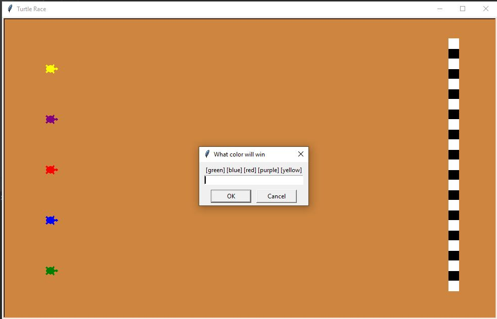
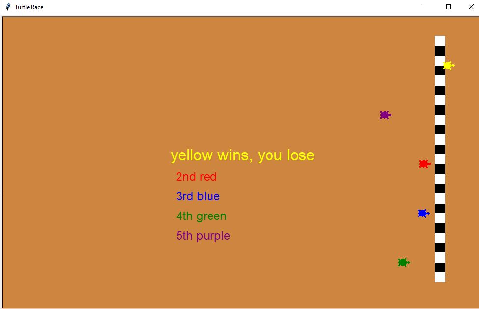

# turtleRacers
A simple turtle racing game.  
In this game you bet on a turtle to win based on its color. You have five turtles to choose from, green, blue, red, purple, and yellow. 
 The core logic of the game is each turtle has a random chance to move forward between 0 and 20 steps, the first turtle to move forward 400 steps wins. 
This process is visualized using the turtle graphics module. 
 Screen shots
  start screen 
 
  end screen 
 
